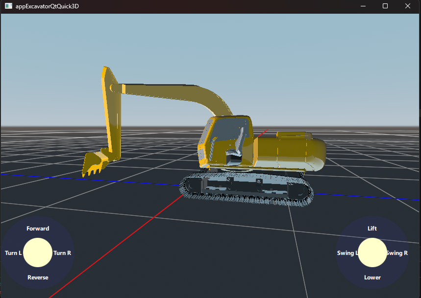
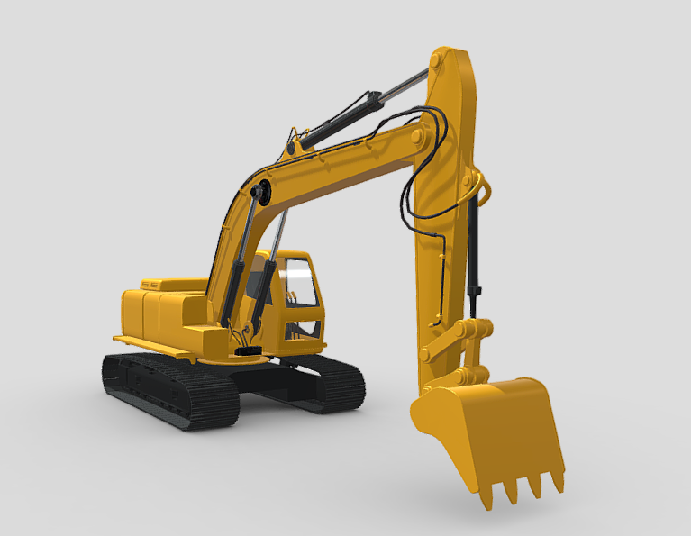
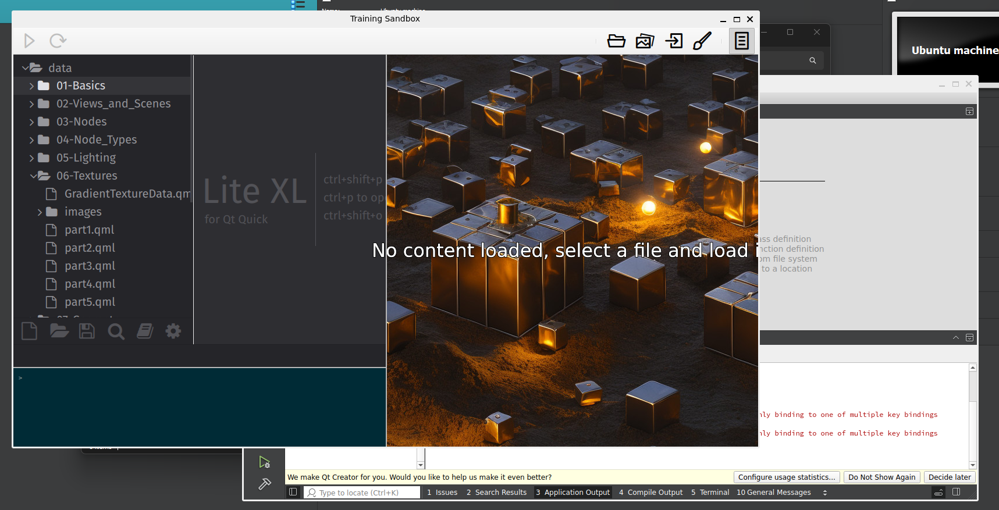
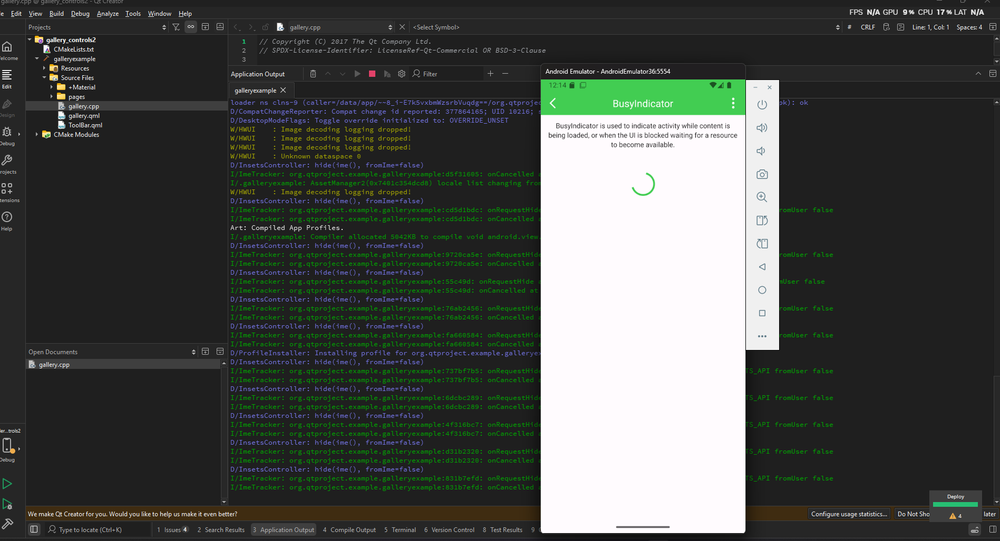
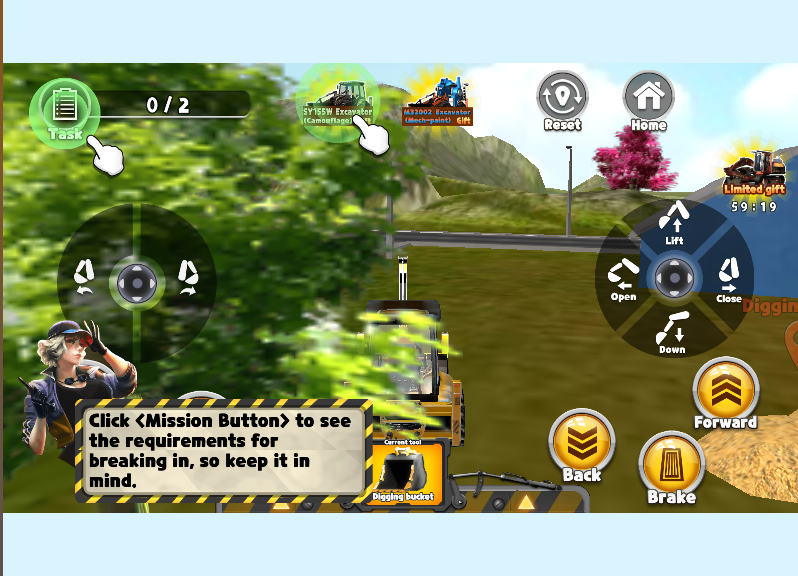
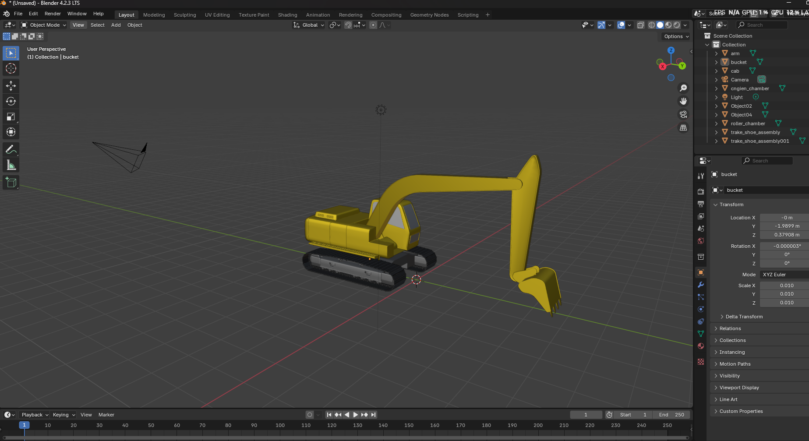
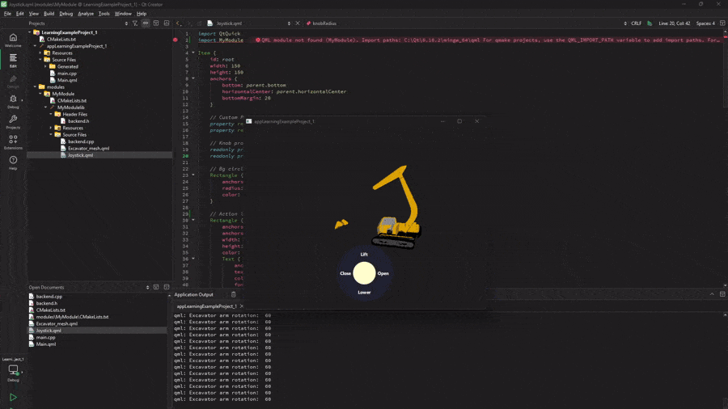
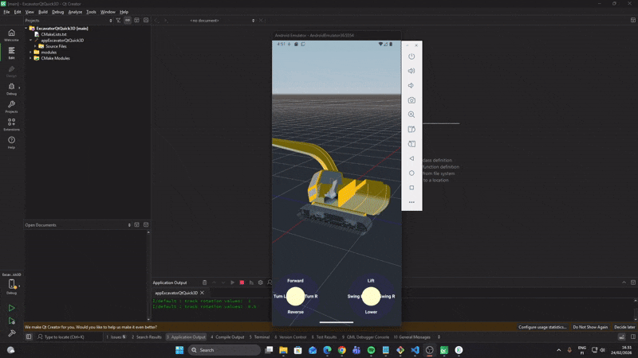

# ExcavatorQtQuick3D - An Interactive QtQuick3D Demo Project

This project is an interactive excavator model demo using QtQuick3D, QML and C++, showcasing real-time 3D control, smooth animation and an intuitive and simple UI design. This project went from concept to the present MVP within 7 days from Tuesday, February 17th to the following Tuesday, February 24th, 2026.




## Project Overview

The demo project was developed using the following stack:
- Qt 6.10.2 
- Qt Creator 18.0.2
- emulator API 36
- JDK 21.0.10

### Development kits:
- Qt 6.10.2 MinGW 64-bits for desktop application
- Qt 6.10.2 for Android x86_64 for emulator application
- Qt 6.10.2 for Android armeabi-v7a for device application

### Assets/Attribution
The [excavator 3D model](https://sketchfab.com/3d-models/excavator-c00f6295235349e3b60885a9efa45629) used in this project is a modified version from the original created by **MD.Jobair Hossain** and is licensed under **CC BY 4.0**. 



#### Modification to this model include:
- Removal of wires and hydraulic pumps for simplification of movement
- Conversion through Balsam into its component meshes and QML 

### Functions
The demo features an excavator model that can be controlled through two joysticks located at the lower corners of the screen. Their function is as follows:
- Left joystick up and down: Movement forwards and backwards
- Left joystick left and right: Turning the excavator tracks left or right for selecting the angle of movement
- Right joystick up and down: Lifting and Lowering the main arm
- Right joystick left and right: Swinging the arm and cockpit left and right
- Free camera movement through direction contact with the screen


## Implementation & File Structure
The project has the following file structure:

```bash
ExcavatorQtQuick3D/
├── CMakeLists.txt
├── appExcavatorQtQuick3D/
│   ├── Source Files/
│   │   ├── Generated/
│   │   │   ├── qt6mymodulelib_metatypes.json
│   │   │   └── qt6mymodulelibplugin_init_metatypes.json
│   │   ├── main.cpp
│   │   └── Main.qml
├── modules/
│   └── MyModule/
│       ├── CMakeLists.txt
│       └── MyModulelib/
│           ├── Header Files/
│           │   └── backend.h
│           ├── Resources/
│           │   └── meshes/
│           │       ├── cab_mesh.mesh
│           │       ├── mesh_001_mesh.mesh
│           │       ├── mesh_002_mesh.mesh
│           │       ├── mesh_004_mesh.mesh
│           │       ├── mesh_007_mesh.mesh
│           │       ├── mesh_010_mesh.mesh
│           │       ├── mesh_011_mesh.mesh
│           │       ├── mesh_012_mesh.mesh
│           │       └── mesh_mesh.mesh
│           └── Source Files/
│               ├── backend.cpp
│               ├── Excavator_mesh.qml
│               └── Joystick.qml
```

- `Joystick.qml`: Implements the joystick object UI
- `Excavator_mesh.qml`: Generated by importing the .fbx excavator model to Qt through Balsam, this implements the excavator 3D model and all its textures and moving parts.
- `backend.h` and `backend.cpp`: Implement the backend C++ class that manages model state and communicates between the joystick inputs and the excavator outputs.
 - `*.mesh` : Texture files that represent the 3D model components
 - `Main.qml`: Main qml file where all components are integrated.
 - `Main.cpp`: Main C++ that serves as starting point to the app.

 # Learning Experiences
 Throughout this project many steps and challenges had to be overcome as I'd learn and apply most of the concepts required, save for the knowledge of C++ and the core Qt API, in a short amount of time. The steps and challenges are as follows:

 ## Environment Setup
 The first step to the development, and its first challenge, was the environment setup. The project requirements request the latest versions of all tools, but the various tutorials and docs are generally outdated with regards to Qt Creator/core, Android API, SDK and compilers/development kits. This hides issues such as version incompatibilities, deprecations and other problems, like the following examples:

 ### JDK 25.0.2.10 was largely unsupported
 The tutorial for setup of the android environment was JDK version 11.0.10, outdate compared to the latest JDK 25. But only installing it as part of the environment, I've realized it was incompatible with the local android toolchain, so I had to downgrade it to JDK 21.

 ### Qt 6.10.2 did not yet offer support for MSVC compiler
 Which proved to be an issue when following the Qt Quick 3D tutorial, which uses a Training Sandbox that packaged many useful tools for prototyping, but was built using an older version of Qt which was incompatible with 6.10 MinGW development kit. As a workaround, I used WSL, the Windows Subsystem for Linux, which allowed me to build the Training Sandbox in Ubuntu Linux, parallel to the Windows development environment but outside of it.

 

## Learning Ramp
Once the environment was setup, I needed to close the knowledge gap in aspects like Qt for Android, QML and Qt Quick 3D. I it did mostly using the Qt Academy, which I found to have almost all of the topics I needed to build this project, save for specific quirks, like creating joysticks, for these I made use of youtube channels, forums, and yes, AI. 

During my learning I created little prototypes and made use of library examples to test concepts. One of those prototypes, the "LearningExampleProject_1" ended up becoming the basis for the final delivery, so I have added it to the repository if you'd like to see some horrible coding.

 

 ## Creation Process

 Once enough progress was done with the learning concepts, I then decided on the design and content aspects of the project. For the joystick controls, I took inspiration on a little web game where you control an excavator:

  

  ### Model
  Then it was a matter of selecting a specific model and making use of it in the project, after a number of small prototypes with different models, I chose the current version for its simplicity and small number of pieces, since a bigger number of pieces means more moving parts.

  At first it wasn't clear how the different pieces would move, since the first tutorials only used static .glb files and those could not be modified. After going deeper into the Qt academy courses, I realized I was going to need to do modify my model in Blender and export it as a .dae (collada) file to Balsam, so it could generate a detailed QML map of every moving piece.

  

  In Blender I removed some wires and other tiny pieces, since I didn't yet know how to move multiple pieces together, so the final 3D model is a quite stripped down version of its initial glory.

## Development
Throughout the development process, I've had to go back and forth to the tutorials to understand the 3D concepts like EulerRotation, vectorization, movement and etc. 
These were some of the main challenges I faced:

### Coordination between model and backend
Even with prior knowledge of signals and slots, their different implementation in QML was a matter of ramping up to me, specifically in aspects like the setting up of QML-visible properties:

   ``` Q_PROPERTY(float armRotation READ armRotation NOTIFY armRotationChanged FINAL) ```

Or how to communicate those backend-modified properties with QML class properties like: ```property real armRotation``` in Excavator_mesh.qml.

### Node hierarchy in QML
Some of the learning challenges was the parenting of nodes which was not something explicitly explained in the introductory tutorials, so that was a learning-on-the-fly concept.



## Deployment
Finally, the last stage of the development was the testing of the demo in different platforms: Android Galaxy Nexus emulator, a desktop application and a Galaxy A53 mobile device of personal use.
Thankfully, no major issues were observed during this phase, and it speaks volumes to the robustness of the development kit.

<p float="left"> 
     
      
</p>


## Bugs are areas of Improvement
This project is a PoC (Proof of Concept) for showcasing learning a development skills, and should not be considered a completed product. If given more time, I would make the following improvements

### Align and improve rotation limits
Due to the modular nature of the development, the angles of rotation of the different parts of the excavator might not be convenient and have mismatches with each other.

### Improve and optimize the UI for different mobile models
The positioning of the joystick might not necessarily work well on every mobile and sometime be too low on the screen, these cosmetic and quality of life improvements would certainly be addressed with more time.

### Improve model rendering and granular movement
The 3D model has rendering issues most likely due to the modifications made to it in Blender in order to simplify the movement. With more time, those issues could be overcome to include movement of other component, like the shovel, in order to have a more visually pleasing model.

### Background and controls
The background is currenly quite bare bones, and there are few other controls except the joystick. Given more time, more insteresting background and ground terrain could be included to add aestetic value to the project. 
